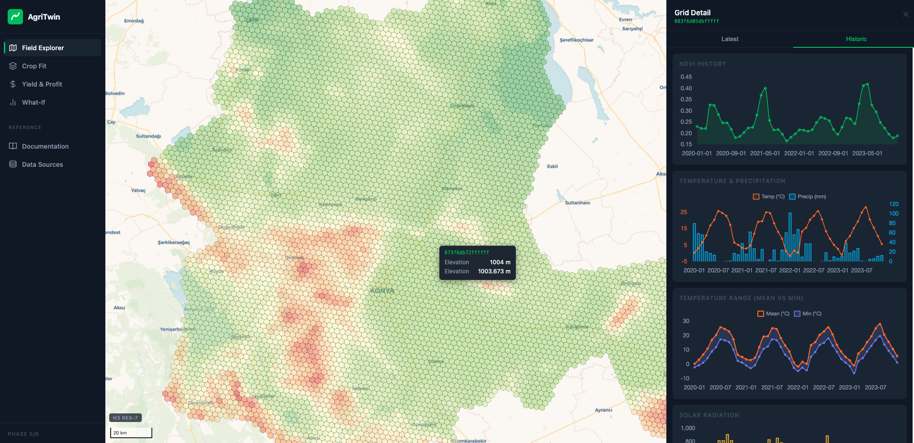

# AgriTwin

An agricultural digital twin for Konya Province, Turkey. Integrates satellite, climate, and soil data into an interactive map with crop suitability scoring, what-if scenario simulation, and yield & profit projections at H3 hexagonal cell resolution.



**[Live Demo →](http://167.233.143.105)**

## Features

- **Field Explorer** — 346,000+ H3 res-9 cells across Konya; per-cell elevation, NDVI, soil pH, and climate timeseries
- **Crop Fit** — suitability scores for 8 crops (Wheat, Barley, Sugar Beet, Sunflower, Maize, Chickpea, Lentil, Cotton) based on monthly ERA5 climate vs. crop requirements
- **Yield & Profit** — estimated yield and net profit per cell using FAOSTAT prices and TAGEM production costs
- **What-If Scenarios** — draw a polygon, apply environmental overrides (±temperature, ±precipitation, soil pH), and compare re-scored results side-by-side with baseline

## Architecture

```
agriTwin-etl  ──→  PostgreSQL + PostGIS + TimescaleDB  ──→  agriTwin-app
(data pipeline)          (shared database)                   (Flask web app)
```

The ETL pipeline downloads ERA5 climate, SoilGrids soil properties, FAOSTAT crop statistics, and TAGEM production cost data; processes them into H3 cells; and computes baseline crop suitability scores. The web app reads from the same database and adds scenario simulation via a Celery worker.

## Repositories

| Repo | Description |
|---|---|
| [`agriTwin-app`](https://github.com/ridvanzengin/agriTwin-app) | Flask web app — MapLibre map, crop suitability, scenario simulation, yield & profit |
| [`agriTwin-etl`](https://github.com/ridvanzengin/agriTwin-etl) | ETL pipeline — data ingestion, H3 processing, suitability scoring, economics |

## Tech Stack

**App:** Python · Flask · SQLAlchemy · MapLibre GL JS · Chart.js · Celery · Redis · Gunicorn · Docker  
**ETL:** Python · pandas · H3 · psycopg · Shapely · ERA5/CDS API · SoilGrids · FAOSTAT  
**Database:** PostgreSQL · PostGIS · TimescaleDB · Alembic

## Local Setup

Requires Docker and Docker Compose.

```bash
# 1. Clone all three repos into the same parent directory
git clone https://github.com/ridvanzengin/agritwin
git clone https://github.com/ridvanzengin/agriTwin-app agritwin/agriTwin-app
git clone https://github.com/ridvanzengin/agriTwin-etl agritwin/agriTwin-etl

# 2. Follow the app setup (Docker Compose starts the full stack)
cd agritwin/agriTwin-app
cp .env.example .env        # set FLASK_SECRET_KEY
docker compose up --build -d
```

See [`agriTwin-app/README.md`](https://github.com/ridvanzengin/agriTwin-app#readme) for the full setup guide including ETL data loading.

## License

MIT — see [LICENSE](LICENSE)
